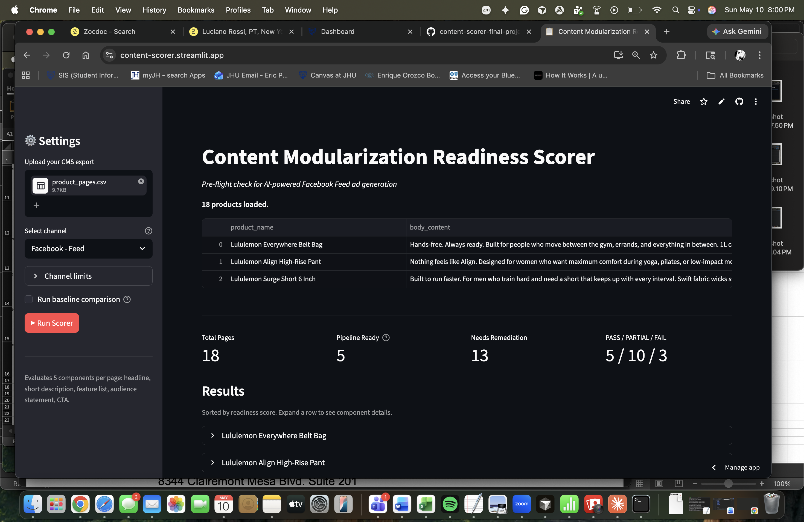

# Content Modularization Readiness Scorer

*The pre-flight check for AI-powered paid social ad generation*

---

## 1. Context, User, and Problem

**Who the user is:** A content strategist or content manager at a brand using an internal AI pipeline to generate paid social ad variants (Instagram, Facebook) from existing product description pages.

**The workflow being improved:** Before feeding product pages into an AI generation pipeline, someone needs to check whether the source content is structurally ready. Today, no one does this systematically. Teams discover the problem when the AI output is bad: truncated headlines, generic copy, missing CTAs.

**Why it matters:** Instagram and Facebook ad fields have hard character limits — a headline truncates at 40 characters, primary text at 125. When source content is not modular (components are buried in prose, not independently extractable), AI generation either hallucinates to fill structural gaps or produces output a human has to rewrite. That defeats the automation.

This tool surfaces those failures **before** the pipeline runs. It is the readiness check that has to happen before the agent gets turned on.

---

## 2. Solution and Design

### What was built

A Streamlit app that accepts a CSV export from a CMS and scores each product page across five content components required for paid social ad generation:

| Component | What it checks |
|---|---|
| `headline` | Short, self-contained claim usable as an ad headline |
| `short_description` | Primary text — readable without the headline |
| `feature_list` | Discrete, independently extractable product features |
| `audience_statement` | Clear identification of who the product is for |
| `cta` | Verb-led action directive suitable for a CTA button |

Each component receives one of four statuses: **pass**, **embedded**, **dependent**, or **missing** — with a specific reason for any non-pass result.

### Architecture

```
CSV upload → Python pre-check (HTML stripping, char limit validation, metadata check)
           → Anthropic API call with tool use (structured scoring per component)
           → Streamlit dashboard (sortable results table + component detail view)
```

- **Tool use / function calling:** The model calls a `score_component` tool for each of the five components. The tool schema constrains `component_name` to five allowed values and `status` to four allowed values, guaranteeing structured output across all pages.
- **Engineered system prompt:** The scoring rubric lives in a dynamic system prompt built per channel. It enforces a four-stage decision tree (present → separable → independent → pass), explicit pass/fail examples, and strict constraints preventing the model from editorializing or suggesting rewrites.
- **Channel-aware config:** Character limits are defined per channel in `app/channels.py`. Switching channels updates both the deterministic pre-checks and the model's system prompt. Currently supports Instagram Main Feed (headline: 40 chars, primary text: 125 chars, CTA: 20 chars).
- **Model:** `claude-haiku-4-5-20251001` at temperature 0.1 for consistency.
- **Baseline comparison:** Optional toggle runs the same content through a prompt-only approach (no rubric, no tool schema) for side-by-side comparison.

### Key design choice

The Python script handles everything deterministic (character limit checks, metadata completeness, HTML stripping, schema validation). The model handles only the semantic judgment — whether a component is structurally extractable. Neither can do the other's job.

---

## 3. Evaluation and Results

### Test set

15 synthetic Lululemon product pages covering common failure patterns:

| Tier | Count | Failure patterns represented |
|---|---|---|
| PASS | 5 | All five components clearly present and extractable, metadata complete |
| PARTIAL | 7 | Run-on prose, missing CTAs, embedded features, incomplete metadata |
| FAIL | 3 | Dependent headlines, narrative-only content, missing most components |

Ground truth labels are documented in `data/product_pages.csv` (`expected_result` column).

### What counted as good output

A correct result means the scorer's tier (PASS / PARTIAL / FAIL) matches the ground truth label for that product page. A useful failure explanation is one that names the specific structural reason a component cannot be extracted (e.g. "headline requires surrounding context to be understood" rather than "content needs improvement").

### Scorer accuracy

The scorer correctly classified **14 of 15 products** against ground truth labels. The one correction required was a labeling error in the ground truth — two products initially labeled FAIL were found to have 4/5 extractable components and were correctly relabeled PARTIAL after manual review. This is itself a finding: the scorer can surface labeling inconsistencies in content audits.

### Baseline comparison

The baseline uses the same model and content but replaces the rubric and tool schema with a single open-ended prompt:

> *"You are a content strategist evaluating product pages for use in an AI-powered paid social ad generation pipeline. Review the following product page and identify any issues that would prevent AI from reliably generating ads from this content. Be specific about what needs to change."*

**Key difference:** The rubric scorer names the failing component and the structural reason (`feature_list: EMBEDDED — features are grammatically fused into narrative prose`). The baseline produces paragraph-level feedback with no consistent structure, making it difficult to act on at scale or compare across pages.

Enable the baseline toggle in the sidebar to run both approaches side by side on your own data.

### Where it broke down

- **Ambiguous feature lists:** Period-separated sentences (e.g. "Duck down fill. Water-repellent shell.") required explicit calibration in the rubric to be recognized as a passing feature list rather than embedded prose. The boundary between structured and unstructured content is the hardest edge case.
- **Shared content:** A single sentence serving as both headline and short description is not handled by the rubric. The scorer may credit one and mark the other missing.
- **Scope boundary:** The scorer evaluates structural modularity only. A page that scores PASS may still produce off-brand or factually incorrect ad copy. This is a structural prerequisite check, not a content quality guarantee.

---

## 4. Artifact Snapshot

The app scores 15 product pages and renders a sortable dashboard with color-coded readiness tiers. Each row expands to show the five-component breakdown with status badges and failure reasons, plus a metadata completeness checklist.



*Sample output for a failing product:*
```
Lululemon ABC Pant Classic — 1/5 components
  headline          PASS
  short_description EMBEDDED   Features woven into run-on prose, not extractable as standalone description
  feature_list      EMBEDDED   No discrete list structure; fabric properties described in continuous sentence
  audience_statement MISSING   No explicit audience identification
  cta               MISSING    Content ends with product description, no action directive
```

---

## 5. Setup and Usage

### Requirements

- Python 3.9+
- An Anthropic API key ([get one here](https://console.anthropic.com))

### Installation

```bash
git clone https://github.com/epep1991/content-scorer-final-project.git
cd content-scorer-final-project
python3 -m venv venv
source venv/bin/activate
pip install -r requirements.txt
```

### API Key Setup

Create a `.env` file in the project root:

```bash
echo 'ANTHROPIC_API_KEY=your_key_here' > .env
```

The `.env` file is gitignored and never committed. The app reads the key from this file automatically.

### Running the app

```bash
streamlit run app/streamlit_app.py
```

Open the URL shown in the terminal (typically `http://localhost:8501`).

### Using the app

1. In the sidebar, upload `data/product_pages.csv` (included in this repo)
2. Select **Instagram - Main Feed** as the channel
3. Click **▶ Run Scorer**
4. Expand any product row to see the component-level breakdown

### CSV format

The app accepts any CSV with these columns:

| Column | Required | Description |
|---|---|---|
| `product_name` | Yes | Product display name |
| `body_content` | Yes | Full product description (HTML accepted) |
| `product_category` | No | Category label |
| `tags` | No | Comma-separated tags |
| `seo_title` | No | SEO title field |
| `seo_description` | No | SEO description field |
| `image_url` | No | Primary image URL |
| `image_alt_text` | No | Image alt text |
| `expected_result` | No | Ground truth label (PASS / PARTIAL / FAIL) — used for accuracy display only |

Column names are normalized automatically (spaces and capitalization are handled).

### Project structure

```
content-scorer-final-project/
├── app/
│   ├── streamlit_app.py        # Streamlit UI
│   ├── scorer.py               # Scoring engine (API calls, pre-checks)
│   └── channels.py             # Channel definitions and dynamic system prompt
├── data/
│   └── product_pages.csv       # 15 synthetic test pages with ground truth labels
├── .agents/skills/
│   └── content-component-scorer/   # Reusable skill (from HW5)
├── requirements.txt
└── .env                        # Not committed — create this yourself
```
