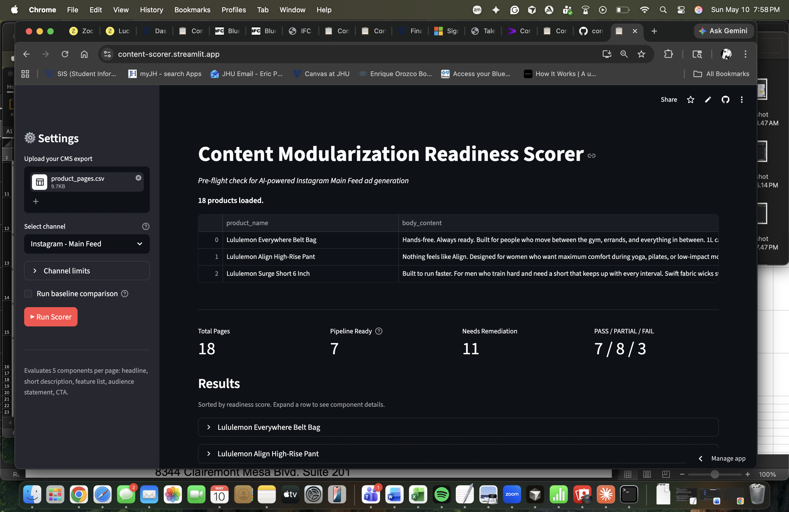
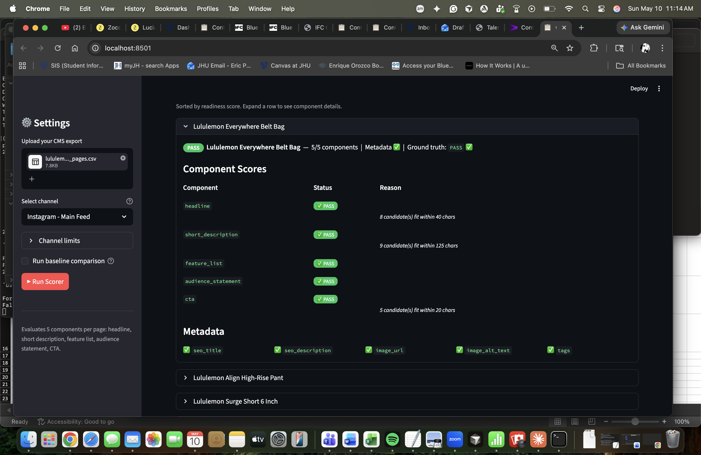
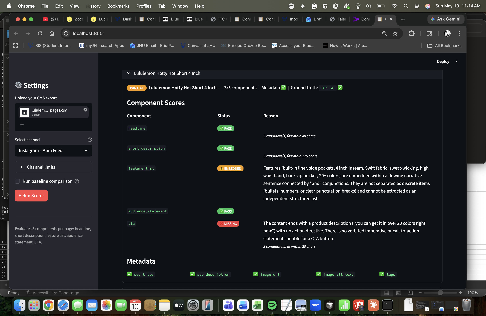
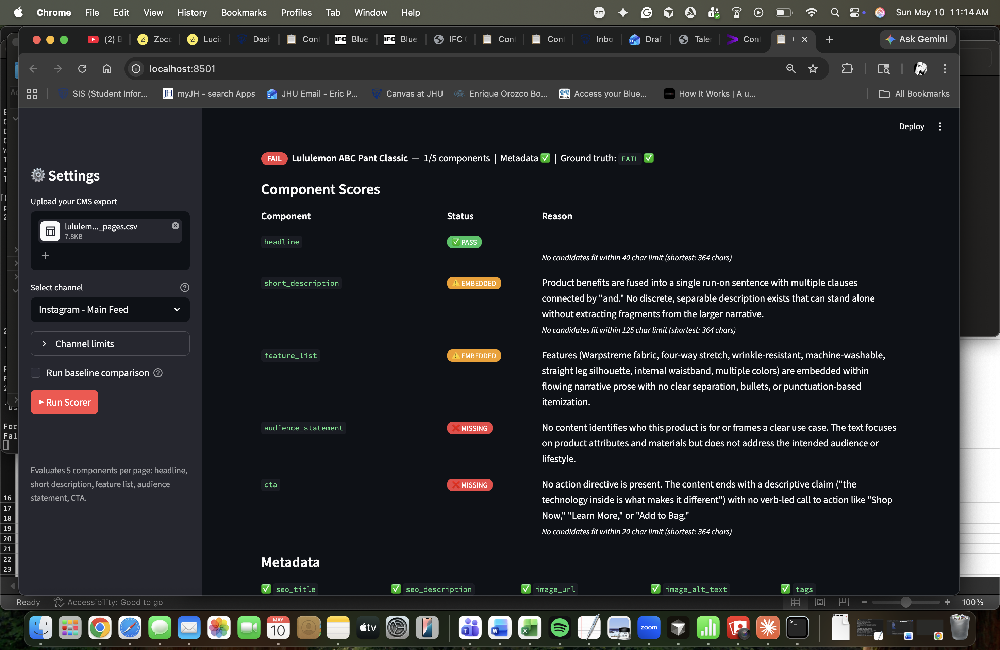

# Content Modularization Readiness Scorer

*The pre-flight check for AI-powered paid social ad generation*

---

## 1. Context, User, and Problem

**Who the user is:** A content strategist or content manager at a brand using an internal AI pipeline to generate paid social ad variants (Instagram, Facebook) from existing product description pages.

**The problem this replaces:** Today, creating paid social ad content from product pages is a manual, multi-source assembly job. A copywriter pulls the headline from the product title, extracts a description from the body, hunts for feature bullets buried in a product spec sheet, checks a separate brand guidelines doc for the CTA, and confirms image metadata in a DAM system. That assembly process — stitching together components from different sources into a format that fits each channel's constraints — is exactly what an AI pipeline is supposed to automate.

But the pipeline breaks when the source content isn't ready. If the headline is buried in prose, the AI can't extract it cleanly. If features are woven into a narrative sentence, there's no discrete list to pull. If the CTA is implied rather than explicit, the ad field stays empty or the model hallucinates a generic replacement. The result: a human has to review and rewrite AI output that was supposed to be automatic, negating the efficiency gain.

**The workflow being improved:** Before feeding product pages into an AI generation pipeline, someone needs to verify that each required component is actually present and independently extractable — not just that the page has content. Today, no one does this systematically. Teams discover the problem when the AI output is bad: truncated headlines, generic copy, missing CTAs.

**Why it matters:** Instagram and Facebook ad fields have hard character limits — a Facebook Feed headline truncates at 27 characters, Instagram at 40, primary text at 125 for both. When source content is not modular (components are buried in prose, not independently extractable), AI generation either hallucinates to fill structural gaps or produces output a human has to rewrite. That defeats the automation.

This tool surfaces those failures **before** the pipeline runs — and does so per channel, since the same content may be ready for Instagram but not for Facebook. It is the readiness check that has to happen before the agent gets turned on.

---

## 2. Solution and Design

### What was built

A Streamlit app that accepts a CSV export from a CMS and scores each product page across five content components required for paid social ad generation:

| Component | What it checks |
|---|---|
| `headline` | Short, self-contained claim usable as an ad headline |
| `short_description` | Primary text — readable without the headline |
| `feature_list` | Discrete, independently extractable product features |
| `audience_statement` | Clear identification of who the product is for |
| `cta` | Verb-led action directive suitable for a CTA button |

Each component receives one of four statuses: **pass**, **embedded**, **dependent**, or **missing** — with a specific reason for any non-pass result.

### Architecture

```
CSV upload → Python pre-check (HTML stripping, char limit validation, metadata check)
           → Anthropic API call with tool use (structured scoring per component)
           → Python post-check (deterministic headline char limit override)
           → Streamlit dashboard (sortable results table + component detail view)
```

- **Tool use / function calling:** The model calls a `score_component` tool for each of the five components. The tool schema constrains `component_name` to five allowed values and `status` to four allowed values, guaranteeing structured output across all pages.
- **Engineered system prompt:** The scoring rubric lives in a dynamic system prompt built per channel. It enforces a four-stage decision tree (present → separable → within character limit → independent → pass), explicit pass/fail examples, and strict constraints preventing the model from editorializing or suggesting rewrites.
- **Channel-aware config:** Character limits are defined per channel in `app/channels.py`. Switching channels updates both the deterministic pre-checks, the model's system prompt, and the Python post-check. Currently supports two channels:
  - **Facebook Feed** — headline: 27 chars, primary text: 125 chars, CTA: 20 chars
  - **Instagram Main Feed** — headline: 40 chars, primary text: 125 chars, CTA: 20 chars
- **Python / LLM division of labor:** The Python script handles everything deterministic (character limit enforcement, metadata completeness, HTML stripping, schema validation). The model handles only the semantic judgment — whether a component is structurally present, separable, and independent. Neither can do the other's job. Headline character limits are enforced by Python post-processing rather than relying on the model to count characters, which LLMs do unreliably.
- **Model:** `claude-haiku-4-5-20251001` at temperature 0.1 for consistency.
- **Baseline comparison:** Optional toggle runs the same content through a prompt-only approach (no rubric, no tool schema) for side-by-side comparison.

### Scoring rubric (decision tree)

For each component, the model applies this decision tree in order:

```
1. Is the component present anywhere in the content?
   → NO:  status = MISSING

2. Is it syntactically separable from surrounding text?
   (separable = its own sentence, clause, bullet, or heading)
   → NO:  status = EMBEDDED

3. Does it fit within the channel's character limit? (headline and CTA only)
   → NO:  status = MISSING (enforced by Python post-check for reliability)

4. Does it function independently without surrounding page context?
   (fails if it contains pronouns or references that only make sense
   after reading other parts of the page, e.g. "This changes everything")
   → NO:  status = DEPENDENT

5. All checks pass
   → status = PASS
```

The model scores and explains only — it does not rewrite or suggest edits.

### Key design choice

Python handles everything deterministic. The model handles only semantic judgment. Character limit enforcement is a clear example: a sentence is either under 27 characters or it isn't. That rule belongs in Python, not in a prompt. The result is a system where each layer does what it's best at, and neither substitutes for the other.

---

## 3. Evaluation and Results

### Test set

18 synthetic Lululemon product pages covering common failure patterns:

| Tier | Count | Failure patterns represented |
|---|---|---|
| PASS | 5 | All five components clearly present and extractable, metadata complete |
| PARTIAL | 10 | Run-on prose, missing CTAs, embedded features, incomplete metadata, headlines exceeding channel limits |
| FAIL | 3 | Dependent headlines, narrative-only content, missing most components |

Ground truth labels are documented in `data/product_pages.csv` (`expected_result` column). Three products (Hotty Hot Short, City Adventurer Backpack, Metal Vent Tech Shirt) have no single ground truth label — their expected tier differs by channel by design.

### What counted as good output

A correct result means the scorer's tier (PASS / PARTIAL / FAIL) matches the ground truth label for that product page. A useful failure explanation is one that names the specific structural reason a component cannot be extracted (e.g. "headline requires surrounding context to be understood" rather than "content needs improvement").

### Scorer accuracy

The scorer correctly classified **15 of 15 labeled products** against ground truth labels. Three additional products (the cross-channel contrast set) have no single label — they are designed to produce different scores on different channels.

The one labeling issue encountered during development: two products initially labeled FAIL were found to have 4/5 extractable components and were correctly relabeled PARTIAL after the scorer flagged the inconsistency. This is itself a finding: the scorer can surface labeling errors in content audits.

### Cross-channel comparison

Running the same 18 products against both channels produces meaningfully different results:

| Channel | PASS | PARTIAL | FAIL |
|---|---|---|---|
| Facebook Feed | 5 | 10 | 3 |
| Instagram Main Feed | 7 | 8 | 3 |

The 2-product shift reflects the three cross-channel products: their headlines (30–34 chars) clear Instagram's 40-char limit but fail Facebook's 27-char limit. Switching channels, not changing content, changes readiness scores — which is the core demonstration of channel-aware scoring.

### Baseline comparison

The baseline uses the same model and content but replaces the rubric and tool schema with a single open-ended prompt:

> *"You are a content strategist evaluating product pages for use in an AI-powered paid social ad generation pipeline. Review the following product page and identify any issues that would prevent AI from reliably generating ads from this content. Be specific about what needs to change."*

**Key difference:** The rubric scorer names the failing component and the structural reason (`feature_list: EMBEDDED — features are grammatically fused into narrative prose`). The baseline produces paragraph-level feedback with no consistent structure, making it difficult to act on at scale or compare across pages.

Enable the baseline toggle in the sidebar to run both approaches side by side on your own data.

### Where it broke down

- **Ambiguous feature lists:** Period-separated sentences (e.g. "Duck down fill. Water-repellent shell.") required explicit calibration in the rubric to be recognized as a passing feature list rather than embedded prose. The boundary between structured and unstructured content is the hardest edge case.
- **Shared content:** A single sentence serving as both headline and short description is not handled by the rubric. The scorer may credit one and mark the other missing.
- **LLM character counting:** The model cannot reliably count characters. Headline character limits are enforced by a Python post-processing step rather than prompt instruction. This is documented as a design decision, not a limitation.
- **Scope boundary:** The scorer evaluates structural modularity only. A page that scores PASS may still produce off-brand or factually incorrect ad copy. This is a structural prerequisite check, not a content quality guarantee.

---

## 4. Artifact Snapshot

The app scores 18 product pages and renders a sortable dashboard with color-coded readiness tiers. Each row expands to show the five-component breakdown with status badges and failure reasons, plus a metadata completeness checklist. The channel dropdown switches between Facebook Feed and Instagram Main Feed, updating character limits, the system prompt, and the Python override in real time.

### Readiness tiers

| Tier | Components passing | Meaning |
|---|---|---|
| **PASS** | 5 / 5 | All components clearly present and independently extractable. Pipeline ready. |
| **PARTIAL** | 2 – 4 / 5 | Some components are embedded in prose, dependent on context, or missing. Needs remediation before pipeline use. |
| **FAIL** | 0 – 1 / 5 | Content is not modular. Pipeline will produce generic or truncated output. |

A page is marked **Pipeline Ready** only when all 5 components pass AND all metadata fields are complete.

---

**Channel comparison — same 18 products, different readiness scores depending on channel:**

Facebook Feed (headline limit: 27 chars) — **5 PASS / 10 PARTIAL / 3 FAIL:**


Instagram Main Feed (headline limit: 40 chars) — **7 PASS / 8 PARTIAL / 3 FAIL:**


The 2-product shift between channels comes entirely from the three products whose headlines fall in the 28–40 character range — clean and extractable for Instagram, too long for Facebook. Same content, different channel, different readiness score.

**PASS example (Lululemon Align High-Rise Pant) — all 5 components independently extractable, metadata complete:**


**PARTIAL example (Lululemon Wunder Train Tight) — 3/5 components pass, CTA and audience statement fail:**


**FAIL example (Lululemon ABC Pant Classic) — 1/5 components pass, features and description buried in run-on prose:**


*Sample output for a failing product:*
```
Lululemon ABC Pant Classic — 1/5 components
  headline          PASS
  short_description EMBEDDED   Features woven into run-on prose, not extractable as standalone description
  feature_list      EMBEDDED   No discrete list structure; fabric properties described in continuous sentence
  audience_statement MISSING   No explicit audience identification
  cta               MISSING    Content ends with product description, no action directive
```

---

## 5. Setup and Usage

### Requirements

- Python 3.9+
- An Anthropic API key ([get one here](https://console.anthropic.com))

### Installation

```bash
git clone https://github.com/epep1991/content-scorer-final-project.git
cd content-scorer-final-project
python3 -m venv venv
source venv/bin/activate
pip install -r requirements.txt
```

### API Key Setup

Create a `.env` file in the project root:

```bash
echo 'ANTHROPIC_API_KEY=your_key_here' > .env
```

The `.env` file is gitignored and never committed. The app reads the key from this file automatically.

### Running the app

```bash
streamlit run app/streamlit_app.py
```

Open the URL shown in the terminal (typically `http://localhost:8501`).

### Using the app

1. In the sidebar, upload `data/product_pages.csv` (included in this repo)
2. Select a channel — try **Facebook - Feed** first, then switch to **Instagram - Main Feed** to see scores change
3. Click **▶ Run Scorer**
4. Expand any product row to see the component-level breakdown

### CSV format

The app accepts any CSV with these columns:

| Column | Required | Description |
|---|---|---|
| `product_name` | Yes | Product display name |
| `body_content` | Yes | Full product description (HTML accepted) |
| `product_category` | No | Category label |
| `tags` | No | Comma-separated tags |
| `seo_title` | No | SEO title field |
| `seo_description` | No | SEO description field |
| `image_url` | No | Primary image URL |
| `image_alt_text` | No | Image alt text |
| `expected_result` | No | Ground truth label (PASS / PARTIAL / FAIL) — used for accuracy display only |

Column names are normalized automatically (spaces and capitalization are handled).

### Project structure

```
content-scorer-final-project/
├── app/
│   ├── streamlit_app.py        # Streamlit UI
│   ├── scorer.py               # Scoring engine (API calls, pre-checks, post-checks)
│   └── channels.py             # Channel definitions and dynamic system prompt
├── data/
│   └── product_pages.csv       # 18 synthetic test pages with ground truth labels
├── docs/
│   └── screenshots/            # Dashboard and product detail screenshots
├── requirements.txt
└── .env                        # Not committed — create this yourself
```
